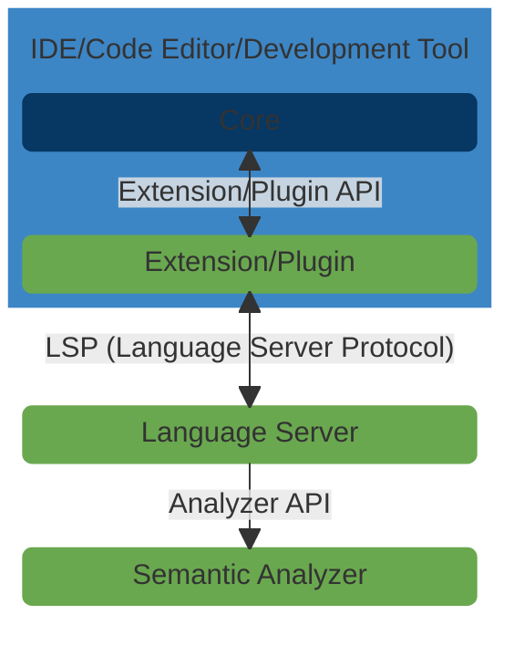

#  ink! analyzer

A collection of modular and reusable libraries and tools for semantic analysis of [ink!] smart contracts.

ink! analyzer aims to improve [ink!] language support in [integrated development environments (IDEs)][IDE],
[source code editors][editor] and other development tools by providing modular and reusable building blocks
for implementing features like diagnostic errors, code completion suggestions, code/intent actions,
inlay hints, signature help and hover content for the [ink! programming language][ink!] -
which is used for writing smart contracts for blockchains built with [Substrate][substrate].

- [Introductory blog post](https://analyze.ink/blog/introducing-ink-analyzer).

[ink!]: https://use.ink/
[IDE]: https://en.wikipedia.org/wiki/Integrated_development_environment
[editor]: https://en.wikipedia.org/wiki/Source-code_editor
[substrate]: https://substrate.io/

## Components

### 1. 🔬 [Semantic Analyzer][analyzer]

A modular domain-specific semantic analysis library for ink! built on a resilient and lossless parser.
It's responsible for parsing the smart contract code, analyzing it based on ink!'s semantic rules for smart contracts and returning semantic information for other components to consume.

[analyzer]: https://github.com/ink-analyzer/ink-analyzer/tree/master/crates/analyzer

### 2. 🗣 [Language Server][lsp-server]

A [Language Server Protocol (LSP)][LSP] implementation built on top of the semantic analyzer.
It acts as a backend that provides language support features to IDEs, code editors and other development tools.
It can be reused by multiple IDEs, code editors and other development tools that support LSP servers including 
[Visual Studio Code, Visual Studio, Vim / Neovim, Emacs, Atom, Sublime Text, Acme, Lapce, Eclipse and many more][LSP-client].

[lsp-server]: https://github.com/ink-analyzer/ink-analyzer/tree/master/crates/lsp-server
[LSP]: https://microsoft.github.io/language-server-protocol/
[LSP-client]: https://microsoft.github.io/language-server-protocol/implementors/tools/

### 3. 👩‍💻 Extensions/plugins/integrations for IDEs, code editors and other development tools

Extensions/plugins/integrations add ink! language support to IDEs, code editors and other development tools. 
They communicate with the language server running as a separate process using the [Language Server Protocol][LSP] 
via [JSON-RPC].

Planned extensions/plugins/integrations:
- [Visual Studio Code Extension][extension-github] ([Install from Marketplace][extension-marketplace])
- IntelliJ Plugin (Q1/2026)

[JSON-RPC]: https://www.jsonrpc.org/
[extension-github]: https://github.com/ink-analyzer/ink-vscode
[extension-marketplace]: https://marketplace.visualstudio.com/items?itemName=ink-analyzer.ink-analyzer

## Acknowledgements

🎨 Illustration by: [Dima Moiseenko][Dima]

🌱 Funded by: the [Web3 Foundation][W3F] and [Polkadot Treasury][Treasury].

[Dima]: https://illustratordima.com/
[W3F]: https://web3.foundation/
[Treasury]: https://polkadot.network/ecosystem/treasury/